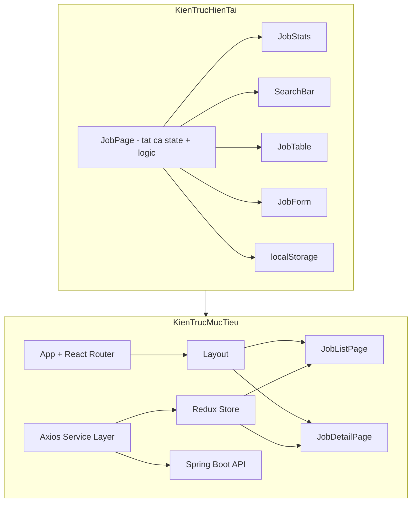
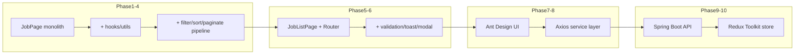

# Kế Hoạch Phát Triển Job Portal

## Phân Tích Hiện Trạng

Codebase hiện tại khớp với báo cáo: `[JobPage.jsx](d:/Job_Portal/src/pages/JobPage.jsx)` là smart component duy nhất quản lý toàn bộ state (`jobs`, `searchKeyword`, `isFormOpen`, `editingJob`), CRUD, filter và localStorage sync. Các child components (`[JobTable.jsx](d:/Job_Portal/src/components/JobTable.jsx)`, `[JobForm.jsx](d:/Job_Portal/src/components/JobForm.jsx)`, `[SearchBar.jsx](d:/Job_Portal/src/components/SearchBar.jsx)`, `[JobStats.jsx](d:/Job_Portal/src/components/JobStats.jsx)`) là presentational thuần.

**Điểm mạnh:** CRUD hoàn chỉnh, UI đẹp, data flow rõ ràng (lifting state up).

**Điểm cần cải thiện trước khi thêm thư viện:**

- Logic filter nằm inline trong `JobPage` — khó mở rộng sort/pagination
- `SearchBar` là uncontrolled — khó reset/sync khi filter phức tạp hơn
- Không có tách layer (utils/hooks/services) — sẽ khó migrate sang API
- `salary` là string — cần chuẩn hóa trước khi sort/filter lương




---

## Thứ Tự Phase (Đã Điều Chỉnh)

Thứ tự gốc của bạn hợp lý; điều chỉnh nhỏ:

- **Gộp Job Detail + React Router** (Phase 6) — trang chi tiết cần routing, không nên làm modal tạm rồi refactor
- **Form validation trước Ant Design** — hiểu validation thuần React trước khi dùng Ant Design Form
- **JSON Server trước Spring Boot** — bước đệm để học Axios mà không bị block bởi backend
- **Redux Toolkit sau khi có API + multi-page** — đúng lúc state phức tạp, không sớm


| Phase | Tên                            | Độ khó | Phân loại   |
| ----- | ------------------------------ | ------ | ----------- |
| 1     | Củng cố React fundamentals     | Dễ     | MUST HAVE   |
| 2     | Tìm kiếm & lọc nâng cao        | Dễ–TB  | MUST HAVE   |
| 3     | Sắp xếp (Sorting)              | TB     | MUST HAVE   |
| 4     | Phân trang (Pagination)        | TB     | MUST HAVE   |
| 5     | Validation & UX tốt hơn        | TB     | MUST HAVE   |
| 6     | React Router + Trang chi tiết  | TB     | MUST HAVE   |
| 7     | Ant Design                     | TB–Khó | MUST HAVE   |
| 8     | Axios + JSON Server (mock API) | TB     | MUST HAVE   |
| 9     | Spring Boot API                | Khó    | MUST HAVE   |
| 10    | Redux Toolkit                  | Khó    | MUST HAVE   |
| 11    | Tính năng nâng cao             | Khó    | SHOULD/NICE |


---

## Phase 1: Củng Cố React Fundamentals

**Mục tiêu:** Refactor codebase an toàn, tách logic khỏi UI, chuẩn bị nền tảng cho filter/sort/paginate.

**Tính năng:** Custom hooks, utility functions, constants, controlled SearchBar, cải thiện ID generation.

**Tại sao:** Học cách tổ chức code React đúng cách trước khi thêm complexity. Tech Lead sẽ đánh giá khả năng refactor, không chỉ copy-paste.

**React concepts:** Custom hooks, `useMemo`, `useCallback`, separation of concerns, controlled vs uncontrolled inputs, derived state.

**Thư viện mới:** Không có.

**Files ảnh hưởng:**

- Tạo: `src/hooks/useLocalStorage.js`, `src/utils/jobFilters.js`, `src/constants/jobTypes.js`
- Sửa: `[JobPage.jsx](d:/Job_Portal/src/pages/JobPage.jsx)`, `[SearchBar.jsx](d:/Job_Portal/src/components/SearchBar.jsx)`

**State:** Giữ nguyên 4 state hiện tại; thêm optional `searchKeyword` controlled ở SearchBar.

**Data flow:** Không đổi — vẫn lifting state up, chỉ di chuyển logic ra utils/hooks.

**Backend:** Không.

**Prerequisites:** Hoàn thành CRUD hiện tại.

**Kết quả mong đợi:** Code gọn hơn, dễ test logic filter sau này, không breaking change.

### Tasks

**Task 1.1 — Tạo `src/constants/jobTypes.js`**

- Mô tả: Export mảng `JOB_TYPES`, `LOCATIONS` (từ data hiện có)
- Mục đích: Single source of truth, dùng lại ở form và filter
- Concepts: Constants module, DRY
- Files: Tạo mới; sửa `[JobForm.jsx](d:/Job_Portal/src/components/JobForm.jsx)`
- Cách làm: Extract hardcoded options từ select
- Phụ thuộc: Không
- Verify: Form vẫn hiển thị đúng 3 loại hình; không regression CRUD

**Task 1.2 — Tạo `src/hooks/useLocalStorage.js`**

- Mô tả: Hook generic `useLocalStorage(key, initialValue)` bọc read/write + error handling
- Mục đích: Tách side effect localStorage khỏi JobPage
- Concepts: Custom hook, lazy init, useEffect sync
- Files: Tạo mới; refactor `[JobPage.jsx](d:/Job_Portal/src/pages/JobPage.jsx)`
- Cách làm: Di chuyển logic lines 20-38 của JobPage vào hook
- Phụ thuộc: Không
- Verify: Reload trang vẫn giữ data; thêm/sửa/xóa vẫn persist

**Task 1.3 — Tạo `src/utils/jobFilters.js`**

- Mô tả: Hàm `filterJobsByKeyword(jobs, keyword)` — extract logic filter hiện tại
- Mục đích: Chuẩn bị pipeline filter → sort → paginate
- Concepts: Pure functions, immutability
- Files: Tạo mới; sửa JobPage
- Phụ thuộc: Không
- Verify: Search vẫn hoạt động identically

**Task 1.4 — Chuyển SearchBar sang controlled component**

- Mô tả: Thêm props `value` + `onChange`; JobPage truyền `searchKeyword`
- Mục đích: Reset search khi clear filter; sync state khi navigate sau này
- Concepts: Controlled input, single source of truth
- Files: `[SearchBar.jsx](d:/Job_Portal/src/components/SearchBar.jsx)`, JobPage
- Phụ thuộc: Task 1.3
- Verify: Gõ/xóa search vẫn filter real-time

**Task 1.5 — Cải thiện ID generation**

- Mô tả: Thay `Date.now()` bằng `Date.now() + Math.random()` hoặc counter incremental
- Mục đích: Tránh trùng ID khi thêm nhanh
- Concepts: Unique keys, list rendering best practices
- Files: `[JobForm.jsx](d:/Job_Portal/src/components/JobForm.jsx)`
- Phụ thuộc: Không
- Verify: Thêm nhiều job liên tiếp, mỗi job có ID unique

**Task 1.6 — Thêm `useMemo` cho filteredJobs**

- Mô tả: Wrap `filterJobsByKeyword(jobs, searchKeyword)` trong useMemo
- Mục đích: Học optimization cơ bản; chuẩn bị cho sort/paginate chain
- Concepts: useMemo, dependency array, derived state
- Files: JobPage
- Phụ thuộc: Task 1.3
- Verify: Filter behavior unchanged; React DevTools không re-compute thừa

---

## Phase 2: Tìm Kiếm & Lọc Nâng Cao

**Mục tiêu:** Mở rộng từ text search sang multi-filter (loại hình, địa điểm).

**Tính năng:** Filter bar với select/checkbox; filter kết hợp (AND logic); nút "Xóa bộ lọc"; hiển thị số kết quả.

**Tại sao:** Job portal thực tế luôn có filter đa tiêu chí — học derived state phức tạp hơn.

**React concepts:** Object state cho filters, computed/derived data, component composition.

**Thư viện:** Không.

**Files:** Tạo `src/components/JobFilterBar.jsx` + CSS; sửa `jobFilters.js`, JobPage, JobStats (optional: stats theo filtered)

**State mới tại JobPage:**

```javascript
filters = { keyword: "", type: "all", location: "all" }
```

**Data flow:**

```
User thay đổi filter → setFilters → useMemo pipeline → filteredJobs → JobTable
```

**Backend:** Không.

**Prerequisites:** Phase 1 hoàn thành.

**Kết quả:** User lọc theo loại hình + địa điểm + keyword đồng thời.

### Tasks

**Task 2.1 — Mở rộng `jobFilters.js`**

- Mô tả: Hàm `applyJobFilters(jobs, filters)` hỗ trợ keyword + type + location
- Concepts: Pure function composition, AND filtering
- Verify: Unit test thủ công với console hoặc vài case known

**Task 2.2 — Tạo `JobFilterBar` component**

- Mô tả: Select "Loại hình", select "Địa điểm", button "Xóa bộ lọc"
- Concepts: Presentational component, callback props
- Verify: Mỗi filter hoạt động độc lập và kết hợp

**Task 2.3 — Gộp SearchBar vào filter state**

- Mô tả: Thay `searchKeyword` riêng bằng `filters.keyword` object thống nhất
- Concepts: State consolidation
- Verify: Search cũ vẫn hoạt động

**Task 2.4 — Hiển thị "X kết quả tìm thấy"**

- Mô tả: Text dưới toolbar hiển thị `filteredJobs.length`
- Phân loại: SHOULD HAVE
- Verify: Số cập nhật khi filter thay đổi

**Task 2.5 — Empty state có context**

- Mô tả: Phân biệt "Chưa có job" vs "Không có kết quả phù hợp bộ lọc"
- Phân loại: SHOULD HAVE
- Verify: Message đúng trong từng scenario

---

## Phase 3: Sắp Xếp (Sorting)

**Mục tiêu:** Click header cột để sort asc/desc.

**Tính năng:** Sort theo title, company, location; toggle asc/desc/none; visual indicator trên header.

**Tại sao:** Học sort state + immutable array sort + UI feedback.

**React concepts:** Sort state `{ field, direction }`, useMemo chain, event handlers on table header.

**Thư viện:** Không.

**Files:** Tạo `src/utils/jobSort.js`; sửa JobTable, JobPage

**State mới:** `sortConfig = { field: null, direction: 'asc' }`

**Data flow:**

```
jobs → applyJobFilters → sortJobs → displayedJobs → JobTable
```

**Lưu ý salary:** Phase này sort salary alphabetically (string). Chuẩn hóa salary number là NICE TO HAVE ở phase sau.

**Prerequisites:** Phase 2.

**Kết quả:** Bảng sort được theo ít nhất 3 cột.

### Tasks

**Task 3.1 — Tạo `sortJobs(jobs, sortConfig)` utility**

- Mô tả: Pure function, không mutate array gốc (`[...jobs].sort()`)
- Verify: Sort asc/desc đúng cho string fields

**Task 3.2 — Thêm sort state vào JobPage**

- Mô tả: Pipeline useMemo: filter → sort
- Verify: Sort áp dụng trên filtered results, không phải toàn bộ jobs

**Task 3.3 — Clickable table headers trong JobTable**

- Mô tả: Props `sortConfig`, `onSort(field)`; icon ↑↓ neutral
- Verify: Click toggle asc → desc → none (hoặc asc → desc)

**Task 3.4 — CSS sort indicator**

- Mô tả: Highlight cột đang sort
- Phân loại: SHOULD HAVE
- Verify: Visual rõ ràng cột nào đang active

---

## Phase 4: Phân Trang (Pagination)

**Mục tiêu:** Chia danh sách thành trang, tránh render hàng loạt khi data lớn.

**Tính năng:** Pagination controls (Prev/Next, số trang); chọn page size (5/10/20); reset về page 1 khi filter thay đổi.

**Tại sao:** Học slice logic, side effect khi dependency thay đổi, UX pattern phổ biến.

**React concepts:** Pagination state, useEffect reset page, derived paginatedData.

**Thư viện:** Không (pagination thuần React trước; Ant Design Pagination ở Phase 7).

**Files:** Tạo `src/components/Pagination.jsx` + CSS, `src/utils/jobPagination.js`; sửa JobPage, JobTable

**State mới:** `currentPage = 1`, `pageSize = 10`

**Data flow:**

```
jobs → filter → sort → paginate → JobTable
Filter/sort đổi → reset currentPage về 1
```

**Prerequisites:** Phase 3.

**Kết quả:** Bảng hiển thị đúng subset theo trang; STT tính đúng `(currentPage-1)*pageSize + index + 1`.

### Tasks

**Task 4.1 — Utility `paginateJobs(jobs, page, pageSize)`**

- Verify: Slice đúng range

**Task 4.2 — Component Pagination**

- Mô tả: Prev/Next + page numbers + page size select
- Verify: Navigate giữa các trang; disabled Prev ở page 1

**Task 4.3 — Reset page khi filter/sort đổi**

- Mô tả: useEffect watch `[filters, sortConfig]` → setCurrentPage(1)
- Concepts: Synchronizing state
- Verify: Đang ở page 3, đổi filter → về page 1

**Task 4.4 — Seed thêm mock data (optional)**

- Mô tả: Thêm 15-20 jobs vào initialJobs để test pagination có ý nghĩa
- Phân loại: SHOULD HAVE
- Verify: Có đủ data để thấy nhiều trang

---

## Phase 5: Form Validation & UX Tốt Hơn

**Mục tiêu:** Validation rõ ràng, feedback sau thao tác, thay `window.confirm` bằng UI đẹp hơn.

**Tính năng:** Field-level validation; error messages tiếng Việt; toast notification (thuần React/CSS); ConfirmModal component; loading state giả lập (chuẩn bị API).

**Tại sao:** Học form state phức tạp hơn `required` HTML; UX professional trước khi migrate sang Ant Design.

**React concepts:** Validation state object, conditional error rendering, portal/modal pattern, `useCallback` cho handlers.

**Thư viện:** Không (toast/modal tự build).

**Files:** Tạo `src/components/Toast.jsx`, `src/components/ConfirmModal.jsx`, `src/utils/jobValidation.js`; sửa JobForm, JobPage

**State mới:** `formErrors` (trong JobForm), `toast` (trong JobPage hoặc Context nhẹ — **chưa cần Redux**)

**Prerequisites:** Phase 4.

**Kết quả:** Form hiện lỗi cụ thể; thêm/sửa/xóa có toast; xóa qua modal confirm đẹp.

### Tasks

**Task 5.1 — Tạo `validateJobForm(formData)` utility**

- Mô tả: Validate title/company/location min length; salary format cơ bản
- Verify: Submit form trống → errors hiển thị; fix → errors clear

**Task 5.2 — Hiển thị field errors trong JobForm**

- Mô tả: State `errors`, render `<span className="error">` dưới mỗi field
- Verify: Mỗi field có message riêng

**Task 5.3 — Tạo Toast component (pure React)**

- Mô tả: Stack toast góc màn hình; auto dismiss 3s
- Phân loại: SHOULD HAVE (MUST trước Ant Design `message`)
- Verify: Toast hiện sau add/edit/delete

**Task 5.4 — Tạo ConfirmModal thay window.confirm**

- Mô tả: Modal "Bạn có chắc muốn xóa?" với Cancel/Confirm
- Verify: Cancel không xóa; Confirm xóa + toast

**Task 5.5 — Disable submit khi đang xử lý**

- Mô tả: State `isSubmitting`; chuẩn bị pattern cho API async
- Concepts: Async UX pattern
- Verify: Double-click submit không tạo duplicate

---

## Phase 6: React Router + Trang Chi Tiết Job

**Mục tiêu:** Multi-page app với routing; trang chi tiết job riêng.

**Tính năng:** Routes `/`, `/jobs/:id`, `/about` (optional); Layout chung (header/nav); click job title → detail; 404 page; preserve filter state khi quay lại (via URL query optional).

**Tại sao:** Job portal thực tế là multi-page; học routing, URL params, navigation.

**React concepts:** React Router (`BrowserRouter`, `Routes`, `Route`, `Link`, `useParams`, `useNavigate`, `Outlet`), layout routes, nested routing.

**Thư viện:** `react-router-dom` (lần đầu thêm dependency runtime).

**Files:**

- Tạo: `src/pages/JobListPage.jsx` (extract từ JobPage), `src/pages/JobDetailPage.jsx`, `src/components/Layout.jsx`, `src/pages/NotFoundPage.jsx`
- Sửa: `[App.jsx](d:/Job_Portal/src/App.jsx)`, JobTable (Link on title)

**State:** Job list state vẫn ở JobListPage (hoặc lift lên Layout nếu detail cần access — **chưa cần Redux**).

**Data flow:**

```
/jobs/:id → useParams → find job from jobs array → render detail
Job not found → NotFound hoặc redirect
```

**Backend:** Không.

**Prerequisites:** Phase 5.

**Kết quả:** App có navigation; xem chi tiết job qua URL; browser back hoạt động.

### Tasks

**Task 6.1 — Cài `react-router-dom`**

- Verify: App vẫn chạy `npm run dev`

**Task 6.2 — Tạo Layout với nav links**

- Mô tả: Header "Job Portal", links: Danh sách, Giới thiệu
- Verify: Click nav chuyển trang không reload

**Task 6.3 — Extract JobListPage từ JobPage**

- Mô tả: Di chuyển toàn bộ logic list hiện tại; JobPage rename/refactor
- Verify: CRUD + filter + sort + pagination vẫn hoạt động tại `/`

**Task 6.4 — Tạo JobDetailPage**

- Mô tả: Hiển thị đầy đủ thông tin job; nút Sửa (mở form hoặc navigate); nút Quay lại
- Phân loại: MUST HAVE
- Verify: `/jobs/1` hiển thị đúng job; ID không tồn tại → 404

**Task 6.5 — JobTable: title clickable → Link**

- Verify: Click title → navigate to detail

**Task 6.6 — Optional: sync filter vào URL query**

- Mô tả: `?type=Remote&page=2` — shareable URL
- Phân loại: NICE TO HAVE
- Verify: Reload URL giữ filter

---

## Phase 7: Ant Design

**Mục tiêu:** Migrate UI sang Ant Design theo từng phần, học component library phổ biến trong doanh nghiệp VN.

**Tính năng:** Ant Design Table, Form, Modal, Select, Pagination, message/notification, Layout.

**Tại sao:** Tech Lead yêu cầu; lúc này app đủ phức tạp để thấy lợi ích (Table built-in sort, Form validation rules).

**React concepts:** Third-party component integration, design system theming, gradual migration.

**Thư viện:** `antd` (+ `@ant-design/icons` optional).

**Chiến lược migrate:** **Từng component một**, không rewrite một lần — giữ logic, đổi UI:

1. Button, message → 2. Modal, Form → 3. Table → 4. Pagination, Select

**Files:** Sửa dần các components; tạo `src/theme/antdTheme.js` optional; wrap App với `ConfigProvider`.

**State:** Không đổi — Ant Design components là controlled wrappers.

**Prerequisites:** Phase 6 (multi-page để thấy Layout/Sider/Menu của Ant Design).

**Kết quả:** UI dùng Ant Design; có thể xóa dần CSS custom trùng lặp.

### Tasks

**Task 7.1 — Setup Ant Design + ConfigProvider**

- Mô tả: Cài antd; locale `vi_VN`; primary color match design hiện tại
- Verify: Một Button Ant Design render OK

**Task 7.2 — Thay ConfirmModal + Toast bằng Modal + message**

- Verify: Delete confirm và success toast dùng Ant Design

**Task 7.3 — Migrate JobForm sang Ant Design Form**

- Mô tả: `Form`, `Input`, `Select`; validation rules declarative
- Concepts: Ant Design Form API vs controlled state
- Verify: Validation rules hoạt động; add/edit OK

**Task 7.4 — Migrate JobTable sang Ant Design Table**

- Mô tả: Columns config; sorter; action column
- Verify: Sort, edit, delete actions hoạt động

**Task 7.5 — Migrate Pagination + FilterBar**

- Mô tả: `Pagination`, `Select`, `Input.Search`
- Verify: Filter/sort/paginate pipeline unchanged

**Task 7.6 — Migrate Layout/Navigation**

- Mô tả: `Layout`, `Menu`, `Header`
- Phân loại: SHOULD HAVE
- Verify: Nav giữa các route

**Task 7.7 — Dọn CSS legacy**

- Mô tả: Xóa CSS không còn dùng (giữ `index.css` global tokens nếu cần)
- Phân loại: NICE TO HAVE
- Verify: UI không broken

---

## Phase 8: Axios + Mock API (JSON Server)

**Mục tiêu:** Tách data layer khỏi localStorage; học HTTP client trước Spring Boot.

**Tính năng:** Service layer `jobsApi.js`; CRUD qua REST; loading/error states; environment config; JSON Server làm backend tạm.

**Tại sao:** Học Axios + async patterns trong môi trường an toàn; Tech Lead yêu cầu Axios; không bị block chờ Spring Boot.

**React concepts:** async/await, useEffect data fetching, loading/error UI, abstraction layer (service pattern).

**Thư viện:** `axios`, `json-server` (dev dependency).

**Files:**

- Tạo: `src/services/api.js` (axios instance), `src/services/jobsApi.js`, `db.json`, `.env`
- Sửa: JobListPage (fetch on mount), JobForm handlers (async save)

**State mới:** `isLoading`, `error` tại page level.

**Data flow:**

```
Mount → jobsApi.getAll() → setJobs
Save → jobsApi.create/update → refresh list
Delete → jobsApi.delete → refresh list
```

**Backend:** JSON Server (`npx json-server --watch db.json --port 3001`).

**API contract (chuẩn bị cho Spring Boot):**

```
GET    /jobs
GET    /jobs/:id
POST   /jobs
PUT    /jobs/:id
DELETE /jobs/:id
GET    /jobs?title_like=keyword&type=Full-time
```

**Prerequisites:** Phase 7 (Ant Design Spin/Alert cho loading/error).

**Kết quả:** Data từ API mock; localStorage không còn là source of truth.

### Tasks

**Task 8.1 — Tạo `db.json` từ initialJobs**

- Verify: JSON Server chạy, GET `/jobs` trả data

**Task 8.2 — Setup Axios instance**

- Mô tả: baseURL từ `import.meta.env.VITE_API_URL`; interceptors log error
- Verify: GET request thành công

**Task 8.3 — Implement `jobsApi.js` CRUD functions**

- Verify: Test từng endpoint bằng browser/Postman

**Task 8.4 — Refactor JobListPage: fetch jobs on mount**

- Mô tả: useEffect + loading Spin + error Alert
- Verify: Page load hiện spinner rồi data

**Task 8.5 — Async create/update/delete**

- Mô tả: Await API; toast on success/error; optimistic update (NICE TO HAVE)
- Verify: CRUD qua UI cập nhật db.json

**Task 8.6 — Server-side filter query params (optional)**

- Mô tả: JSON Server hỗ trợ `_like`, filter params
- Phân loại: NICE TO HAVE — client-side filter vẫn OK
- Verify: Search gọi API với query

**Task 8.7 — Xóa localStorage logic**

- Verify: Clear localStorage, app vẫn hoạt động qua API

---

## Phase 9: Spring Boot API Integration

**Mục tiêu:** Thay JSON Server bằng backend thật; học full-stack integration.

**Tính năng:** Spring Boot REST API; MySQL/H2 database; CORS config; frontend chỉ đổi baseURL.

**Tại sao:** Mục tiêu job portal hoàn chỉnh; internship thường yêu cầu full-stack.

**React concepts:** Environment-based config; error handling HTTP status codes; không đổi component logic nếu service layer tốt.

**Thư viện:** Không thêm frontend (Axios đã có).

**Backend requirements (Spring Boot):**

- Entity `Job` (id, title, company, location, salary, type, description, createdAt)
- `JobController` REST CRUD
- `JobRepository` JPA
- CORS cho `http://localhost:5173`
- Validation `@NotBlank` server-side
- Pagination API: `GET /jobs?page=0&size=10&sort=title,asc`

**Files frontend:** Sửa `jobsApi.js` nếu response format khác; thêm field `description` vào form/detail.

**Prerequisites:** Phase 8 (service layer sẵn sàng); Spring Boot basic knowledge.

**Kết quả:** Full-stack app; data persistent trong DB.

### Tasks

**Task 9.1 — Thiết kế Job entity + API contract document**

- Mô tả: Document request/response JSON; thống nhất với frontend
- Verify: Postman collection test pass

**Task 9.2 — Implement Spring Boot CRUD endpoints**

- Verify: All CRUD via Postman

**Task 9.3 — Thêm field `description` (markdown/text)**

- Files: JobForm, JobDetailPage, db schema
- Phân loại: SHOULD HAVE
- Verify: Create job with description; detail page shows it

**Task 9.4 — Frontend: switch API URL to Spring Boot**

- Mô tả: `.env.development` → `VITE_API_URL=http://localhost:8080/api`
- Verify: Frontend CRUD against real backend

**Task 9.5 — Handle API errors gracefully**

- Mô tả: 400 validation errors → hiển thị message; 404 job not found
- Verify: Submit invalid data shows server error

**Task 9.6 — Server-side pagination integration**

- Mô tả: Ant Design Table `pagination` gọi API với page/size params
- Phân loại: SHOULD HAVE
- Verify: Page 2 load từ server, không load all rồi slice client

---

## Phase 10: Redux Toolkit

**Mục tiêu:** Centralized state management khi app có API + multi-page + shared state.

**Tính năng:** `jobsSlice` (list, detail, CRUD async thunks); `filtersSlice` (optional); React-Redux hooks; migrate fetch logic từ component sang thunks.

**Tại sao:** Tech Lead yêu cầu; **đúng thời điểm** vì state đã phân tán và async.

**React concepts:** Redux Toolkit (`createSlice`, `createAsyncThunk`), `useSelector`, `useDispatch`, normalized state, loading/error in store.

**Thư viện:** `@reduxjs/toolkit`, `react-redux`.

**Khi nào Redux được justify (xem section riêng bên dưới):** Sau Phase 9 — có API async, multi-page, cần share state.

**Files:**

- Tạo: `src/store/store.js`, `src/store/jobsSlice.js`, `src/store/filtersSlice.js`
- Sửa: JobListPage, JobDetailPage, App.jsx (Provider)

**State chuyển vào Redux:**

- `jobs`, `isLoading`, `error`, `selectedJob`
- `filters`, `sortConfig`, `pagination` (optional gộp UI slice)

**Data flow:**

```
Component dispatch(fetchJobs(filters))
  → createAsyncThunk → jobsApi.getAll()
  → extraReducers update state
  → useSelector → re-render
```

**Prerequisites:** Phase 9 (API ổn định).

**Kết quả:** State global; components gọn hơn; pattern chuẩn enterprise.

### Tasks

**Task 10.1 — Setup store + Provider**

- Verify: Redux DevTools thấy store

**Task 10.2 — Tạo jobsSlice với async thunks**

- Mô tả: `fetchJobs`, `fetchJobById`, `createJob`, `updateJob`, `deleteJob`
- Verify: JobListPage dùng useSelector/useDispatch; CRUD works

**Task 10.3 — Migrate filter/sort/pagination state (optional)**

- Mô tả: `uiSlice` hoặc `filtersSlice`
- Phân loại: SHOULD HAVE — justify khi navigate giữa list/detail cần giữ filter
- Verify: List → Detail → Back giữ filter state

**Task 10.4 — Refactor JobDetailPage dùng fetchJobById thunk**

- Verify: Direct URL `/jobs/5` load from API

**Task 10.5 — Xóa local useState data fetching cũ**

- Verify: No duplicate state; single source of truth

---

## Phase 11: Tính Năng Nâng Cao

**Mục tiêu:** Hoàn thiện job portal gần production; học thêm patterns.

### MUST HAVE (cho portfolio internship)

- **Loading skeleton** thay vì spinner đơn giản
- **Error boundary** component
- **Responsive mobile** cho table (Ant Design scroll hoặc card view)

### SHOULD HAVE

- **Saved jobs / Bookmarks** (localStorage hoặc API với user)
- **Job application status** (Đã ứng tuyển / Đang xem / Từ chối)
- **Dashboard stats từ API** (endpoint `/jobs/stats`)
- **Search debounce** (`useDeferredValue` hoặc lodash debounce)

### NICE TO HAVE

- **Authentication** (JWT Spring Security + protected routes)
- **Role-based access** (Admin vs User — Admin mới CRUD)
- **Upload company logo**
- **Dark mode toggle**
- **Export CSV**
- **i18n** (react-i18next)
- **Unit tests** (Vitest + React Testing Library)

---

## Tiến Hóa Kiến Trúc




### Cấu trúc thư mục mục tiêu (Phase 10)

```
src/
├── components/       # Presentational (Ant Design wrappers)
├── pages/            # Route-level pages
├── hooks/            # Custom hooks (useDebounce, etc.)
├── utils/            # Pure functions
├── services/         # Axios API calls
├── store/            # Redux slices
├── constants/
└── App.jsx           # Router + Provider
```

### Khi nào Redux được justify?


| Giai đoạn     | Nên dùng                   | Lý do                                                                   |
| ------------- | -------------------------- | ----------------------------------------------------------------------- |
| Phase 1–6     | `useState` + lifting state | State đơn giản, 1–2 pages                                               |
| Phase 8–9     | `useState` + service layer | Async có thể handle ở page level                                        |
| **Phase 10+** | **Redux Toolkit**          | API async thunks, shared state list/detail, filter persist, sắp có auth |


**Rule of thumb:** Introduce Redux khi bạn thấy **prop drilling > 2 cấp** HOẶC **cùng data cần ở 3+ pages** HOẶC **nhiều async operations cần coordinated loading/error state**.

Không introduce Redux sớm chỉ vì Tech Lead yêu cầu — học **khi có pain point thật**.

### Nên implement bằng React thuần trước khi dùng thư viện


| Tính năng            | React thuần trước (Phase) | Thư viện sau (Phase)          |
| -------------------- | ------------------------- | ----------------------------- |
| Filter/Sort/Paginate | 2–4                       | Ant Design Table built-in (7) |
| Form validation      | 5                         | Ant Design Form rules (7)     |
| Toast/Confirm        | 5                         | Ant Design message/Modal (7)  |
| Data fetching        | 8 (useEffect + useState)  | Redux thunks (10)             |
| Routing              | 6 (react-router-dom)      | —                             |
| HTTP calls           | 8 (Axios service)         | —                             |
| State management     | 1–9 (useState/hooks)      | Redux Toolkit (10)            |


---

## Task Đầu Tiên Nên Bắt Đầu

**Recommended first task: Task 1.2 — Tạo `useLocalStorage` hook**

**Lý do:**

1. **An toàn nhất** — extract logic đã hoạt động, không thêm feature mới
2. **Giá trị học cao** — custom hook là concept quan trọng nhất còn thiếu trong project
3. **Nền tảng cho mọi phase sau** — pattern tách logic khỏi component sẽ lặp lại với `useJobFilters`, service hooks
4. **Dễ verify** — reload trang, CRUD, kiểm tra localStorage DevTools
5. **Thời gian ngắn** (~30–45 phút) — momentum tốt cho internship

**Sau Task 1.2, tiếp tục theo thứ tự:** 1.3 → 1.4 → 1.1 → 2.1 → 2.2 ...

---

## Phân Loại Tổng Hợp Features

### MUST HAVE (Core internship deliverables)

- Custom hooks & utils refactor (Phase 1)
- Multi-filter search (Phase 2)
- Sorting (Phase 3)
- Pagination (Phase 4)
- Form validation (Phase 5)
- React Router + Job Detail (Phase 6)
- Ant Design migration (Phase 7)
- Axios + API layer (Phase 8)
- Spring Boot backend (Phase 9)
- Redux Toolkit (Phase 10)

### SHOULD HAVE (Professional polish)

- Result count & contextual empty states
- Sort visual indicators
- Seed data for pagination testing
- Toast notifications
- ConfirmModal
- Layout navigation Ant Design
- Field `description` on jobs
- Server-side pagination
- Filter state persist across navigation (Redux uiSlice)
- Saved jobs / application tracking
- Error boundary
- Mobile responsive table

### NICE TO HAVE (Portfolio extras)

- URL query sync for filters
- Optimistic updates
- Server-side filter via query params (Phase 8)
- Auth + roles
- Dark mode, CSV export, i18n, unit tests

---

## Nguyên Tắc Trong Suốt Quá Trình

1. **Mỗi phase phải ship được** — app luôn chạy được, không broken giữa chừng
2. **Một PR / một phase** — dễ review với Tech Lead
3. **Không thêm thư viện sớm** — chỉ cài khi phase tới
4. **Giữ giao diện tiếng Việt** — labels, errors, toasts
5. **Document API contract** trước Phase 9 — frontend/backend song song
6. **Commit message rõ ràng** theo phase: `feat(phase-2): add job type filter`

